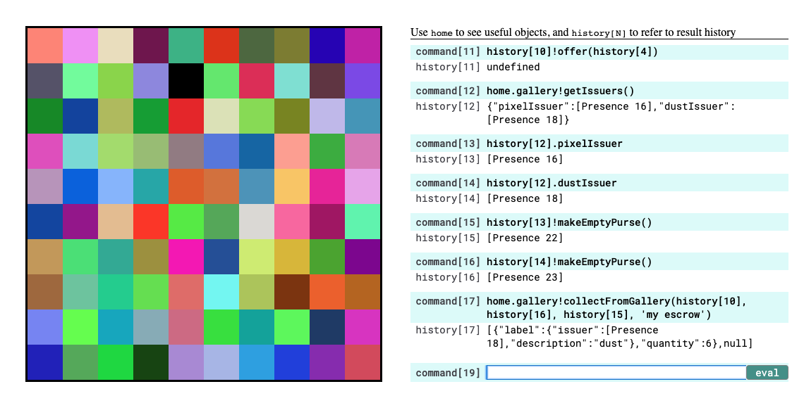
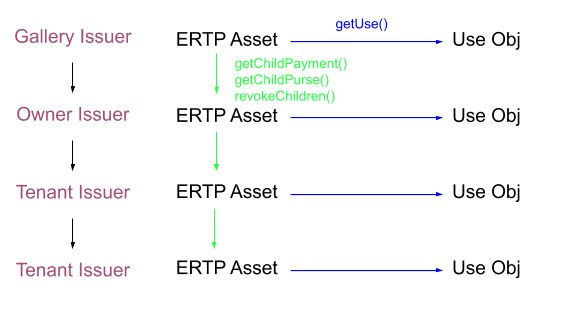

# Pixel Gallery Demo

This demo is roughly based on [Reddit's
r/Place](https://en.wikipedia.org/wiki/Place_(Reddit)), but has a 
number of additional features that showcase the unique affordances of
the Agoric platform, including: higher-order contracts, easy creation
of new assets, and safe code reusability.

|  | 
|:--:| 
| *Reddit's r/place as a social experiment in cooperation* |


## Installation

|  | 
|:--:| 
| *The testnet pixel demo. Slightly fewer pixels.* |


The pixel demo runs on [our private
testnet](https://github.com/Agoric/cosmic-swingset#agorics-cosmic-swingset).
For instructions on how to run a local, off-chain version for
yourself, please see [Scenario 3
here](https://github.com/Agoric/cosmic-swingset#different-scenarios).
The testnet documentation also includes a [short walkthrough of the
demo with sample commands](https://github.com/Agoric/cosmic-swingset#gallery-pixel-demo). If you would rather view the code and learn
more about how the demo works, feel free to read on.

## ERTP: Electronic Rights Transfer Protocol

The pixel demo uses our smart contract framework, called ERTP, or the
Electronic Rights Transfer Protocol. Throw away all you know about
public key hashes mapped to account balances, because ERTP doesn't use
'em. In fact, ERTP itself doesn't have any concept of cryptography. Instead,
it uses object capabilities to enforce access control. Instead of
having to prove ownership of a corresponding private key, in the world
of object capabilities, if your program has a reference to an object,
it can call methods on that object. If it doesn't have a reference, it
can't. For more on object capabilities, see here. For more on ERTP,
see a quick tutorial [here](README.md) and the ERTP interface descriptions
[here](core/issuers.chainmail) and [here](core/assays.chainmail) and [here](core/contractHost.chainmail). 

## A preemption hierarchy of rights

All of the pixels (individual squares) on the demo webpage
are owned by the gallery, the code that administrates the pixels. The
gallery has the power to revoke the pixels from any user at any time. When a user
calls `gallery!tapFaucet()`, the gallery takes the least recently
colored pixel from its current holder (if anyone holds it) and gives
it to the user in the form of an ERTP payment. 

|  | 
|:--:| 
| *The preemption hierarchy of rights in the pixel demo* |

The gallery is able to revoke the pixels held by users because the
pixel demo creates a customized version of ERTP in which rights are
*hierarchical*. Hierarchical rights are familiar in property. For
instance, a property owner might lease an apartment to a tenant, who
might in turn, lease it to a subtenant. Anyone higher in the hierarchy
can take away access from anyone lower in the hierarchy, and give it
to someone else. 

## Creating Pixels

ERTP provides a `makeMint` function that takes in a configuration
function. The pixel demo configuration implements the hierarchical
rights and allows us to add additional methods to purses and payments.

The configuration function passed to `makeMint` has a slot for an
assayMaker function. An assay describes how amounts of a particular
thing are added and subtracted from each other, among other things.
The assay is used, for example, when payments are deposited in purses,
and we must calculate what the new balance of the purse is. It should
be the balance of the payment added to the old balance of the purse,
but it is often not as simple as literal addition. This addition may
be literal addition for amounts that are integers (or more
specifically, positive, natural numbers), but in the pixel demo case,
the pixel assay uses the combining of arrays containing pixels for
"addition". For instance, if a payment containing the pixel [{ x: 2,
y:2 }] is deposited in a purse already containing [{ x: 1, y: 1}] the
new balance is an array of both: [{ x: 1, y: 1}, { x: 2,
y:2 }].

To be able to color a pixel, the user must first get a "use object"
from a purse or payment that contains pixels:

```js
const useObj = E(payment).getUse()
```
 The "use object" that they receive acts just like any
other JavaScript object. It has methods (in this case, all associated
with coloring the pixels in the underlying purse or payment) that can
be called. To color, the user does:

```js
E(useObj).changeColorAll('#000000');
```

with the hex color of their choice. 

## Transferring revocable rights

When a user wants to give another user the ability to color a pixel,
but wants to be able to revoke that ability later, the user can call
`getChildPayment` and pass the childPayment to the other user. The
other user can tell that they aren't getting a payment on the same
level as one that the gallery would give out, and it could be revoked
at any point if `revokeChildren()` is called on the original
payment. 

## Buying and selling pixels

The users can buy and sell pixels with the gallery at any time by
calling `sellToGallery(pixelAmount)` and
`buyFromGallery(pixelAmount)`. They must pass in an `amount` that
describes exactly what they want to sell or buy. If successful, they
will get an invitation from the gallery for a simple, secure escrow
exchange of the pixels for "dust", the currency that the gallery
transacts in. Users do not start out with any dust - they only start
out with access to the faucet.  

In order to amass the pixels that they want in order to draw their
masterpiece, the user will need to sell some pixels to get dust. The
gallery will always buy pixels back, but it values pixels near the
center much more than pixels on the periphery. 
